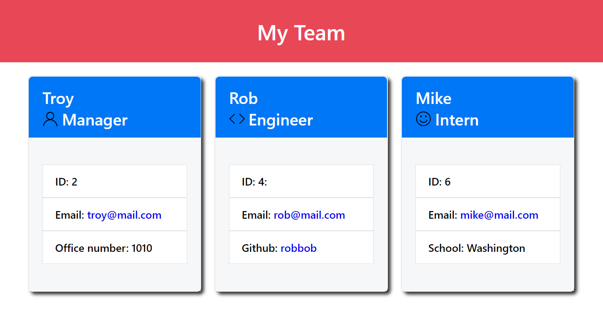
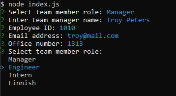

# Team Profile Generator

# Description

The purpose of this project was to create an application that could generate a team profile in the form of an HTML page using the command line terminal.

# Installation

To use this team profile generatore you must install node and the inquirer package, and clone the code from the index.js file in this repository into your own directory.

Install Node: [Node.js](https://nodejs.org/en/download/).

Install Inquirer package: [Inquirer](https://www.npmjs.com/package/inquirer).

# Appearance

# Usage

Use this application to generate a web page with your team member profiles, including name, role, email, and depending on the employee role; office number, github username and school. When adding the email and github username of a team member, the generated page will links open the native email app and github user profile respectively.

Employee Information Includes:

- Name
- ID
- Email

Manager Info Includes

- Office Number

Engineer Info Includes

- github username

Intern Info Includes

- School

## Credits

Credits to Node.js, and mainainers of the Inquirer package and related packages. Also to the maintainers of the [Jest package](https://jestjs.io/) code testing.

## License

This application is available for general use.

## Tests

This application includes the following test files. To run these tests install the [Jest package](https://jestjs.io/).

- Employee.test.js
- Engineer.test.js
- Intern.test.js
- Manager.test.js

## Link to video demonstration

Video demonstrating tests: [GDrive Link](https://drive.google.com/file/d/1pGypd0Z2MNNIBmbWYA_RZcvfAVfj6aRA/view?usp=sharing)

Video demonstrating application: [GDrive Link](https://drive.google.com/file/d/1GZF8LjkH1-Ft5YkvQp1ny3VkoLAbU-1U/view?usp=sharing)
